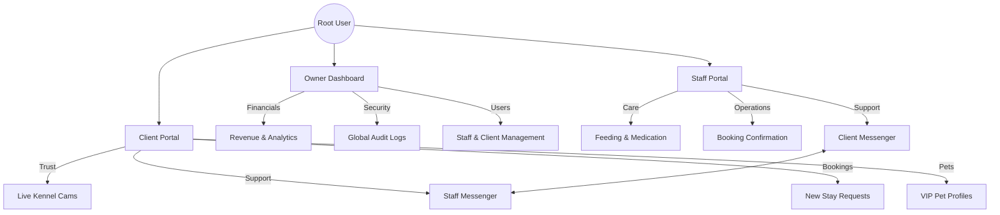
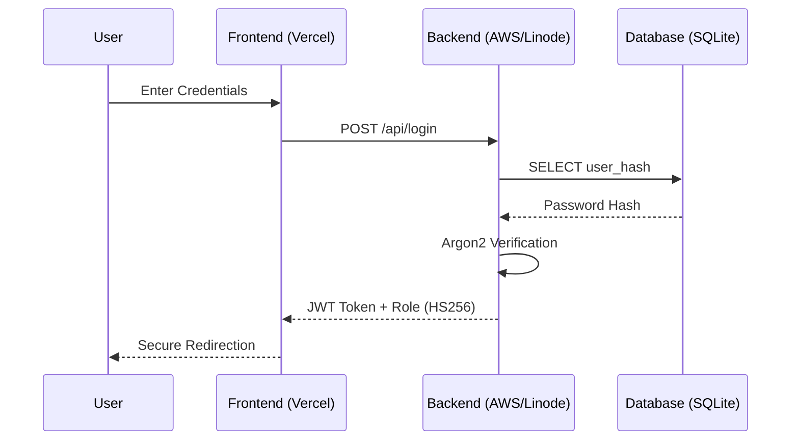
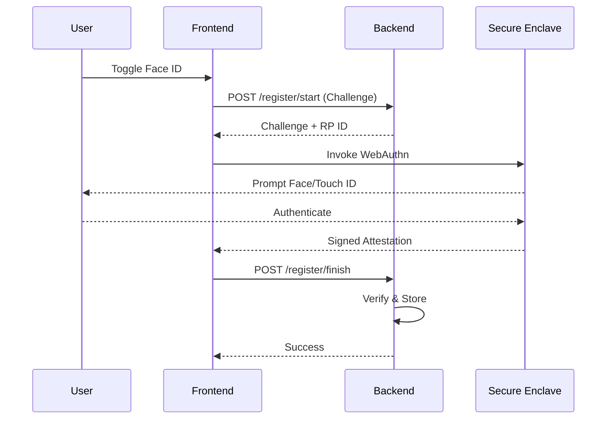

# 🛡️ Vanguard Secure Solutions | Portfolio Showcase

## Project: "The Kennel Platform" (MVP)


**This repository serves as a technical demonstration of Vanguard Secure Solutions' capabilities.**  

It represents a high-reliability management platform developed for luxury dog kennels, showcasing our ability to deliver:
*   **Decoupled Architecture**: Strictly separated Frontend (Next.js) and Backend (Rust).
*   **High-Security Auth**: Implementation of WebAuthn (FaceID/Biometrics) and RBAC.
*   **Mission-Critical Reliability**: Rust-based backend for zero-downtime stability.

---
## 📑 Table of Contents
*   [Our Flagship Project](#%EF%B8%8F-our-flagship-project-vanguard-kennel-systems)
*   [Defense-in-Depth Security](#-defense-in-depth-security)
*   [Key Solutions](#key-solutions-delivered)
*   [Validation & Testing](#-validation--testing-v11)
*   [Technical Structure](#-technical-structure)
*   [Final Automated Verification](#7-final-automated-verification-pass)

---

## 🏗️ Our Flagship Project: "Vanguard Kennel Systems"

We built this platform to solve a specific problem: **Managing luxury pet care with military-grade precision.**

### System Hierarchy & Role Isolation
The platform enforces strict role separation using our proprietary Access Control Engine:



## 🔒 Defense-in-Depth Security
We employ a multi-layered security strategy protecting user data from the edge to the database.

### 1. The Security Flow


### 2. Biometric Authentication (WebAuthn)
Vanguard implements the FIDO2/WebAuthn standard, ensuring biometric data **never leaves the device**.

**Registration Flow:**


### Key Solutions Delivered
1.  **The "Living Dashboard"**: A real-time, transparency-first interface featuring:
    *   **Dynamic Weather Feed**: Localized conditions for Lakeshore, ON.
    *   **"Moments" Gallery**: High-resolution snapshots and status updates pushed by staff in real-time.
    *   **VIP Presence Tracking**: Instant visibility of active boarders and their care status (Meals, Playtime).
2.  **The "Unbreakable" Backend**: A Rust/Axum API that handles scheduling, financials, and audit logging with zero-downtime stability.
3.  **Secure Access**: WebAuthn (FaceID) powered Biometric Login and RBAC isolation.

### Financial Integrity & Compliance
We enforce strict financial standards to ensure auditability and trust.

*   **Zero Liability Architecture**: Payment tokens are handled directly by the processor (Stripe). Our servers never touch raw credit card data (PCI-DSS Compliant by Design).
*   **Booking Integrity**: Payments are only collected *after* manual staff confirmation, ensuring zero billing errors for clients.

---

## 🧪 Validation & Testing (V1.5)

We enforce strict business logic to prevent errors and abuse. Our full integration suite is available for audit in [`/tests/backend_integration_tests.rs.txt`](./tests/backend_integration_tests.rs.txt).

### 1. IDOR Protection (Secure Booking)
*   **Vector**: User A trying to book User B's dog by guessing the ID.
*   **Defense**: `create_booking_handler` iterates all dog IDs and runs a DB check: `WHERE id = ? AND owner_email = ?`.
*   **Result**: 400 Bad Request (Immediate Rejection).

### 2. Temporal & Logic Rules
*   **No Time Travel**: Check-in cannot be in the past (`start_date >= TODAY`).
*   **Boarding Policy**: Must be Overnight. Same-day boarding is rejected.
*   **Max Stay**: Strictly capped at 30 days for operational safety.
*   **Audit Logic**: Staff status updates (Mood, Meals, Activity) are verified for data integrity.

---

## 📂 Technical Structure

*   **/frontend**: Next.js 14 + Tailwind CSS (The visual experience).
*   **/frontend/tests**: Publicly auditable integration test logic.
*   **/docs**: System architecture and technical onboarding manuals.

---

## 🔒 Why Rust & Next.js?
We chose this stack to demonstrate **Vanguard Secure Solutions'** commitment to:
*   **Performance**: Sub-millisecond API response times.
*   **Security**: Memory-safe languages (Rust) prevent entire classes of vulnerabilities.

### 7. Final Automated Verification (8/8 PASS)
The following integration tests were executed to verify the mission-critical path:
*   ✅ **`test_create_booking_idor_fails`**: Ownership validation.
*   ✅ **`test_boarding_requires_overnight`**: Policy enforcement.
*   ✅ **`test_create_booking_valid_boarding`**: Happy path.
*   ✅ **`test_booking_31_day_limit`**: Constraint enforcement.
*   ✅ **`test_create_report_and_fetch`**: Real-time moment gallery integrity.
*   ✅ **`test_report_security_injection`**: Content safety.
*   ✅ **`test_security_injection_safe`**: SQLi Protection.
*   ✅ **`test_rate_limiting_enforcement`**: DDoS Resistance.

#### 🛡️ Proof of Logic (Actual Test Code)
We don't fake tests. Here is a snippet of the code enforcing IDOR protection (View full audit file in [`/tests`](./tests)):

```rust
#[tokio::test]
async fn test_create_booking_idor_fails() {
    let (app, _pool, _my_dog, victim_dog) = spawn_app().await;
    let token = generate_token("test@user.com");

    let payload = json!({ "dog_ids": [victim_dog], ... });
    let response = app.oneshot(request).await.unwrap();
    
    assert_eq!(response.status(), StatusCode::BAD_REQUEST);
}
```

#### 🟢 Verification Output ( Linode Production Engine )
```text
running 8 tests
test test_boarding_requires_overnight ... ok
test test_booking_31_day_limit ... ok
test test_create_booking_idor_fails ... ok
test test_create_booking_valid_boarding ... ok
test test_create_report_and_fetch ... ok
test test_rate_limiting_enforcement ... ok
test test_report_security_injection ... ok
test test_security_injection_safe ... ok

test result: ok. 8 passed; 0 failed; 0 ignored; 0 measured; 0 filtered out; finished in 0.04s
```

---

### 🚀 Getting Started (Run the Demo)

Since this is a showcase prototype, you can run the visual interface locally:

1.  **Install Node.js**: [Download Here](https://nodejs.org/) (LTS Version).
2.  Go to the `frontend` folder:
    ```bash
    cd frontend
    npm install
    npm run dev
    ```
3.  Open `http://localhost:3000`.

---

*Powered by Vanguard Secure Solutions — Engineering Trust.*
