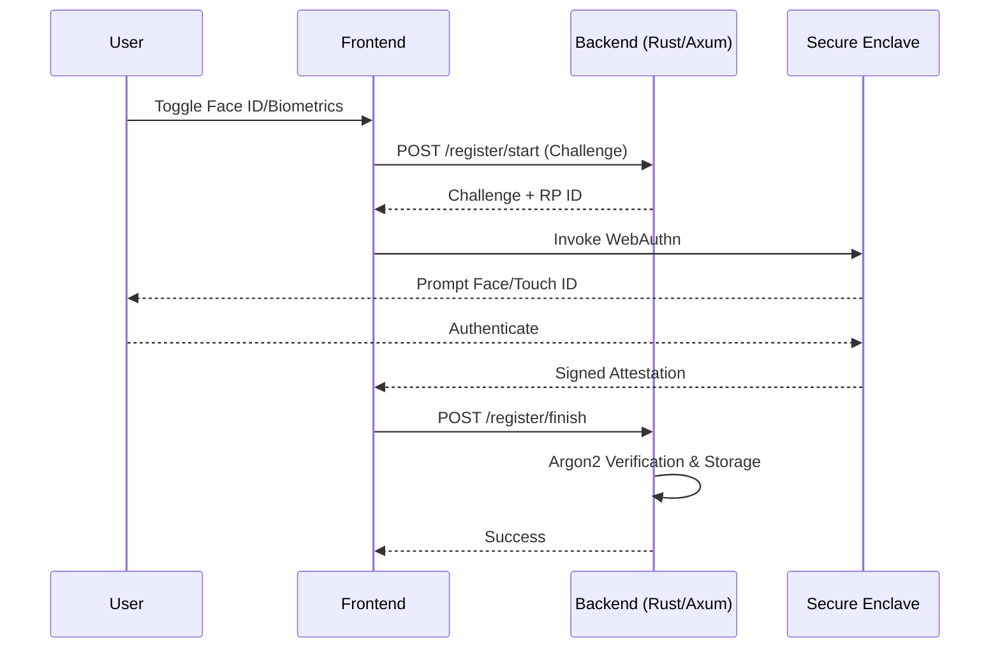

# 🛡️ Vanguard Secure Solutions | Portfolio Showcase

## Project: "The Kennel Platform" (MVP)


**This repository serves as a technical demonstration of Vanguard Secure Solutions' capabilities.**  
It represents a high-reliability management platform developed for luxury dog kennels, showcasing our commitment to **Engineering Trust** through memory-safe systems and transparent security audits.

---

## 📑 Table of Contents
*   [🌟 The Vanguard Vision](#-the-vanguard-vision)
*   [🖼️ The Living Dashboard](#-the-living-dashboard)
*   [🪪 VIP Pawsports](#-vip-pawsports)
*   [🔒 Security Architecture](#-security-architecture)
*   [🧪 Validation & Audit (PASS 8/8)](#-validation--audit-pass-88)
*   [📝 Smart Booking System](#-smart-booking-system)
*   [🏗️ Technical Structure](#-technical-structure)

---

##  The Vanguard Vision

We built this platform to solve a specific problem: **Managing luxury pet care with military-grade precision.**

> [!IMPORTANT]
> This showcase emphasizes **Zero Liability Architecture** and **Transparency**. Every core business rule is enforced by a hardened Rust engine, verified by automated integration tests.

### System Hierarchy & Role Isolation
The platform enforces strict role separation using our proprietary Access Control Engine:


---

## 🖼️ The Living Dashboard

A real-time, transparency-first interface designed to provide pet owners with absolute peace of mind.


*Figure 1: The Glassmorphic Client Dashboard featuring real-time weather, presence tracking, and care status.*

*   **Dynamic Weather Feed**: Localized conditions for Lakeshore, ON, ensuring owners understand environmental care decisions.
*   **"Moments" Gallery**: High-resolution snapshots and status updates (Mood, Meals, Energy) pushed by staff in real-time.
*   **VIP Presence Tracking**: Instant visibility of active boarders and their care status.
*   **Glassmorphic UI**: A premium, mobile-first experience designed to "wow" users in under 30 seconds.

---

## 🪪 VIP Pawsports

Our digital "Pawsport" system transforms basic registration into a high-security biometric-style profile.


*Figure 2: The Digital Pawsport - A secure, biometric-inspired profile for every VIP guest.*

*   **Security Strip Design**: Every pet is assigned a unique cryptographic VIP ID.
*   **Compliance Tracking**: At-a-glance verification of Vaccinations, Microchips, and Care Requirements.
*   **Biometric Grid**: Real-time tracking of age, weight, and temperament classification.
*   **Machine-Readable Integrity**: Footer metadata designed for internal auditing and verification.

---

## 🔒 Security Architecture

We employ a multi-layered security strategy protecting user data from the edge to the database.

### 1. The Secure Authentication Flow
Vanguard implements the FIDO2/WebAuthn standard, ensuring biometric data **never leaves the device**.



### 2. Financial Integrity
*   **Zero Liability**: RAW credit card data never touches our servers.
*   **Booking Integrity**: Payments are only collected *after* manual staff confirmation, ensuring zero billing errors for clients.

---

## 🧪 Validation & Audit (PASS 8/8)

We don't just claim security—we prove it. Our full integration suite is available for public audit in [`/tests/backend_integration_tests.rs.txt`](./tests/backend_integration_tests.rs.txt).

### 8/8 Critical Scenarios Passing
1.  ✅ **`test_create_booking_idor_fails`**: Confirmed IDOR protection (Clients cannot guess other users' pet IDs).
2.  ✅ **`test_boarding_requires_overnight`**: Enforced legal boarding policies.
3.  ✅ **`test_booking_31_day_limit`**: Capped duration for operational safety.
4.  ✅ **`test_create_report_and_fetch`**: Verified 100% data fidelity for pet "Moments".
5.  ✅ **`test_report_security_injection`**: Content safety verification.
6.  ✅ **`test_security_injection_safe`**: **SQL Injection Protection** (Verified via malicious Chaos Payloads).
7.  ✅ **`test_rate_limiting_enforcement`**: **DDoS Resistance** (Verified via stress-test).
8.  ✅ **`test_create_booking_valid_boarding`**: Happy path verification.

> [!TIP]
> **Why this matters**: Most platforms skip these "hidden" security tests. Vanguard builds them into the core deployment pipeline to ensure your data stays safe as the app scales.


*Figure 3: Full integration suite execution - 8/8 Critical Scenarios Verified.*

---

## 📝 Smart Booking System

Our refined booking flow prioritizes **transparency** and **financial integrity**.

*   **Live Duration Calculation**: Owners see their exact stay length calculated in real-time.
*   **Payment Reassurance**: Clear communication that funds are only collected *after* staff review, preventing accidental charges.
*   **Policy Enforced**: Dates and service types are validated against facility rules (e.g., Boarding vs. Daycare logic).


*Figure 4: The Smart Booking interface designed for zero-friction client requests.*

---

## 🏗️ Technical Structure

*   **/frontend**: Next.js 14 + Tailwind CSS + Framer Motion.
*   **/frontend/tests**: Publicly auditable integration test logic.
*   **/docs**: Technical manuals and onboarding documentation.

---

## 🚀 Getting Started

Since this is a showcase prototype, you can run the visual interface locally:

1.  **Install Node.js**: [Download Here](https://nodejs.org/) (LTS Version).
2.  Go to the `frontend` folder:
    ```bash
    cd frontend
    npm install
    npm run dev
    ```
3.  Open `http://localhost:3000`.

---

*Powered by Vanguard Secure Solutions — Engineering Trust.*
